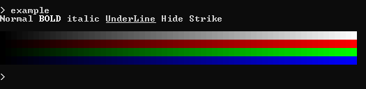

# The ANSI-Project
Make quick ANSI formats to beautify terminal output

Version: `1.0`


## Look for:
[`C/C++`](https://bruneo32.github.io/ANSI-Project/C)
[`C#`](https://bruneo32.github.io/ANSI-Project/CS)
[`Java`](https://bruneo32.github.io/ANSI-Project/Java)
[`Python`](https://bruneo32.github.io/ANSI-Project/Python)


***WebPage: [bruneo32.github.io/ANSI-Project](https://bruneo32.github.io/ANSI-Project)***

***Doc Generated with: [Doxygen](https://www.doxygen.nl/index.html)*** (Except for *Java*)


[](https://bruneo32.github.io/ANSI-Project)
[](https://www.doxygen.nl/index.html)


## Outputs
ANSI interpretation depends on terminal support, so somethings may be different between terminals




### Windows 10
Starting with Windows 10, the console supports ANSI escape sequences, but only if the console is configured to NOT "use legacy console", and the program writing to the console must configure its output to interpret the sequences.

You can execute this command and restart the **cmd** to fix it
```
REG ADD HKCU\CONSOLE /f /v VirtualTerminalLevel /t REG_DWORD /d 1 >nul
```

# Contact
If you publish any project that use the ANSI-Project, *FEEL FREE TO NOTICE ME!*

I would love see your project:
[bruneo32b@gmail.com](mailto:bruneo32b@gmail.com)
